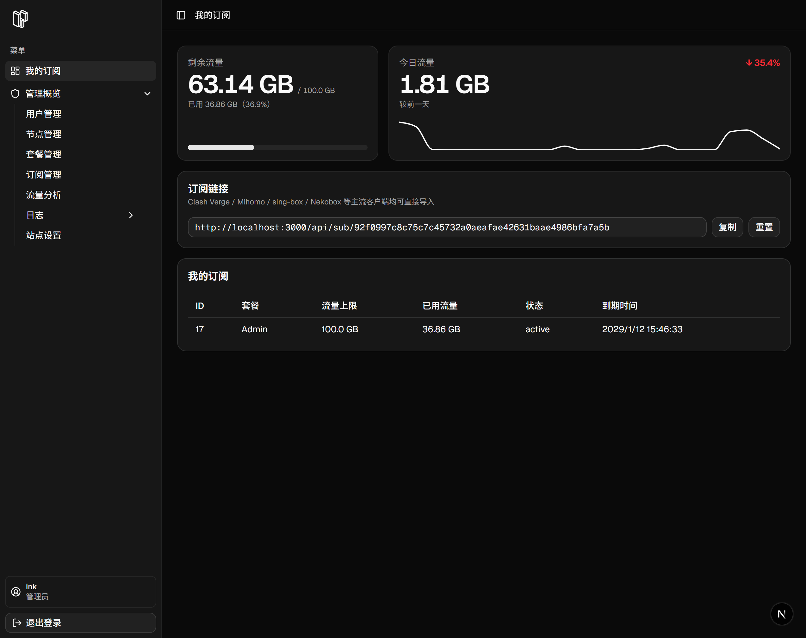

# H2O
Hysteria 2 Ops

[安装教程](docs/0-pre-list.md) | [LinuxDO](https://linux.do/)

---

---

# TODO

- [ ] DNS 解析 可视化配置
- [ ] ACL 流控 可视化配置
- [ ] 出站规则  可视化配置

- [ ] 自动下发 hy2 配置
- [ ] 面板防探测模式（无 cookie 全部 endpoint 返回 404）

- [x] 全局流量统计页（Beta）
- [x] 用户端流量统计卡片（Releases）
