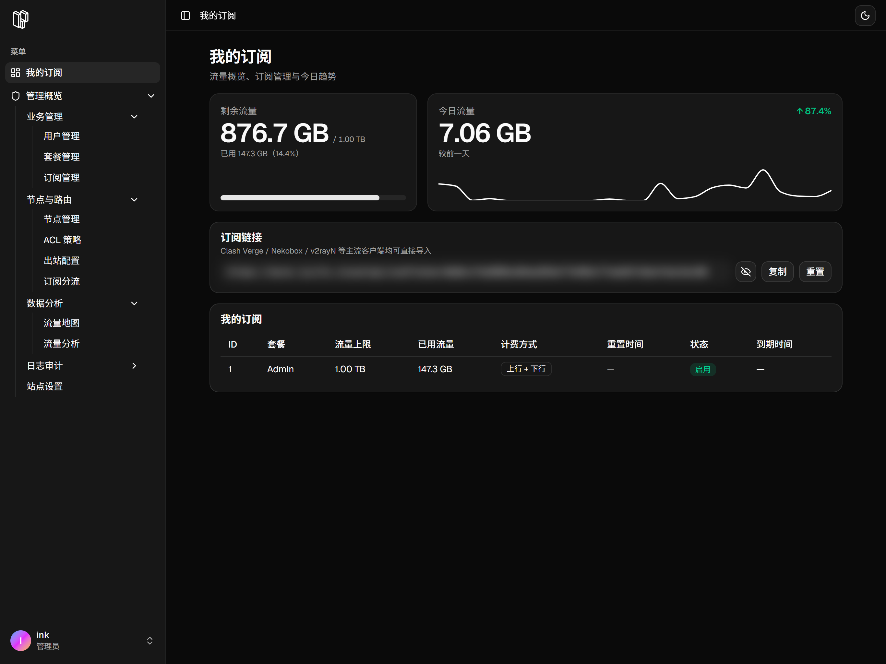
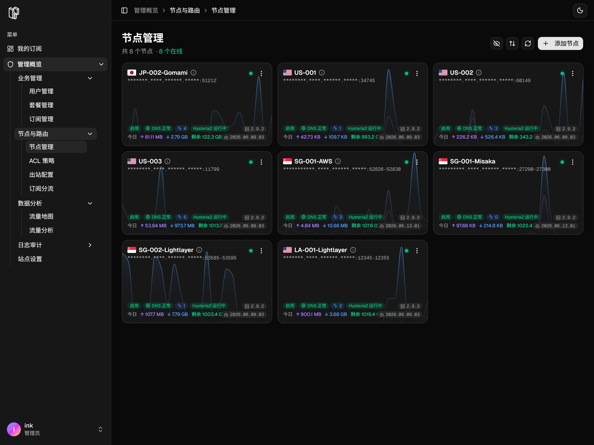
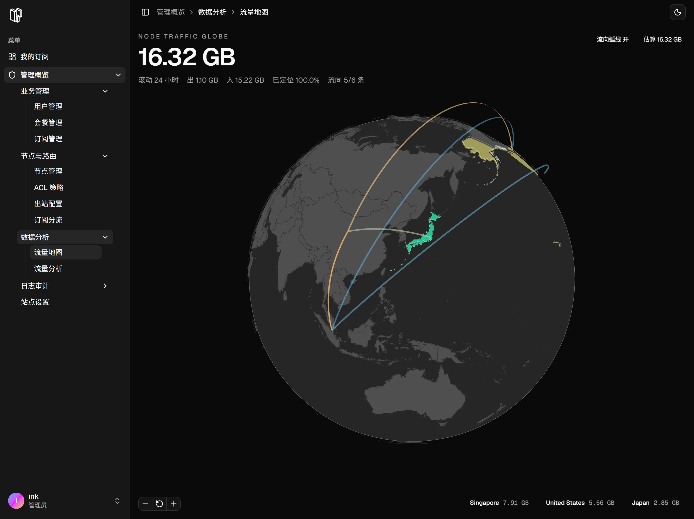

# H2O
Hysteria 2 Ops - 一站式管理你的 Hysteria2 节点

[安装教程](docs/0-pre-list.md) | [交流群](https://t.me/h2o_msg) | [LinuxDO](https://linux.do/)

---

- 订阅链接

- 节点管理

- 流量地图

---

# TODO

- [ ] DNS 解析 可视化配置

- [x] 订阅分流 可视化配置（Beta）
- [x] ACL 流控 可视化配置
- [x] Outbound 可视化配置
- [x] 远程控制/更新 Hysteria2
- [x] 全局流量统计页
- [x] 用户端流量统计卡片
- [x] 套餐/订阅 分配

## Star History

<a href="https://www.star-history.com/?repos=SIPC%2FH2O&type=date&legend=top-left">
 <picture>
   <source media="(prefers-color-scheme: dark)" srcset="https://api.star-history.com/chart?repos=SIPC/H2O&type=date&theme=dark&legend=top-left" />
   <source media="(prefers-color-scheme: light)" srcset="https://api.star-history.com/chart?repos=SIPC/H2O&type=date&legend=top-left" />
   
 </picture>
</a>