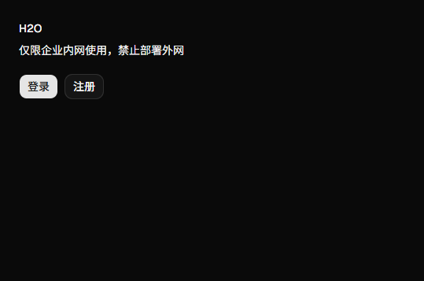
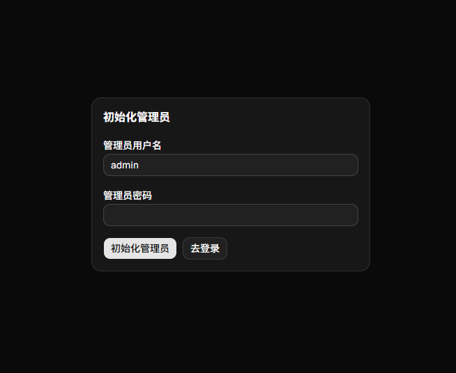

## 1. 面板安装

---
1. 服务器新建目录（例如 `h2o`）。
2. 上传项目中 `docker-compose.yml` 。
3. 在该目录执行：

```bash
docker compose up -d
```

启动后访问：`http://你的服务器IP:3000`



首次使用请进入：`http://你的服务器IP:3000/init` 创建管理员账号。



常用命令（可选）：

- 查看状态：`docker compose ps`
- 查看日志：`docker compose logs -f`
- 停止服务：`docker compose down`

---

[2. 一键安装 Hysteria2 以及 H2O Agent](2-auto-install-hy2.md)
