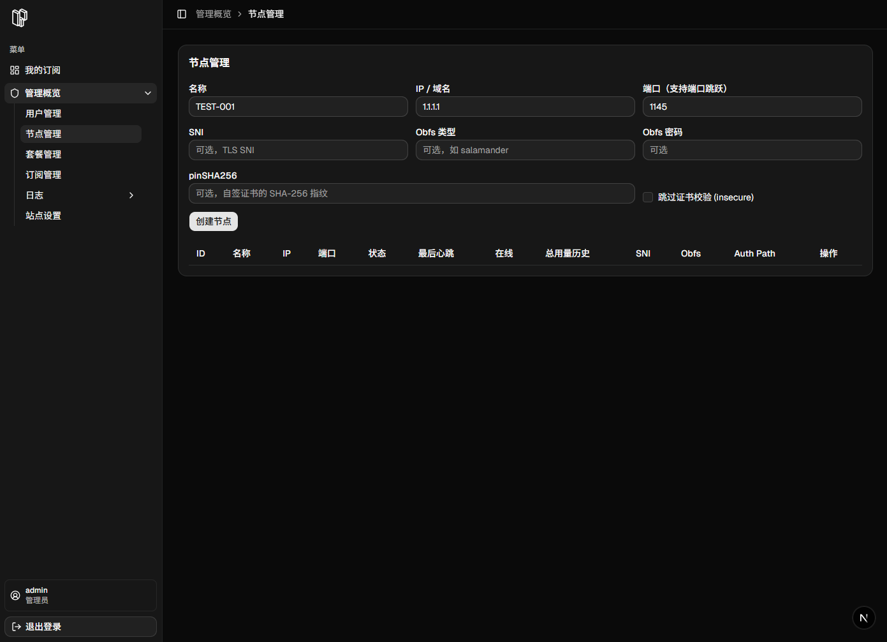
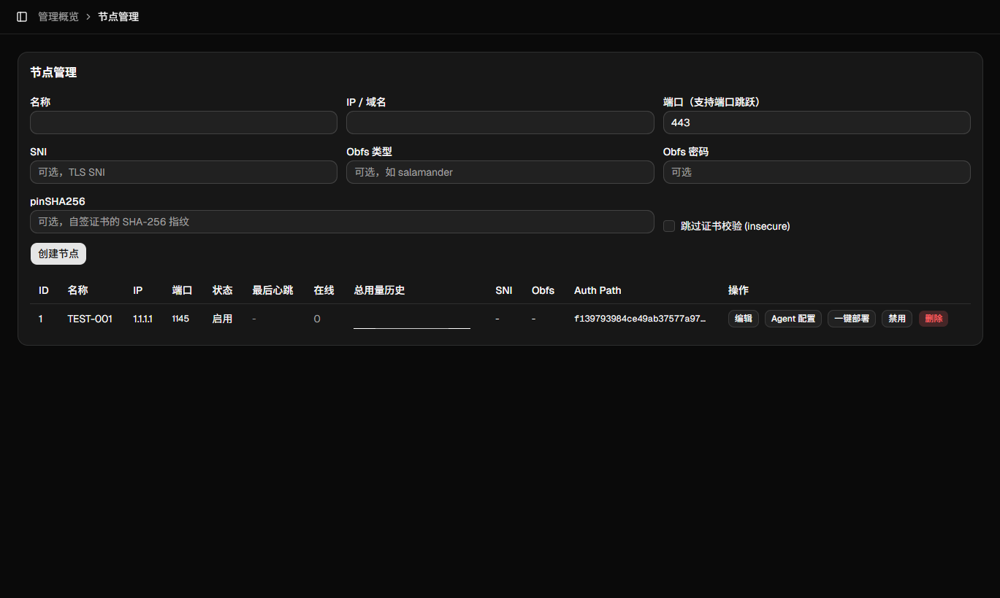
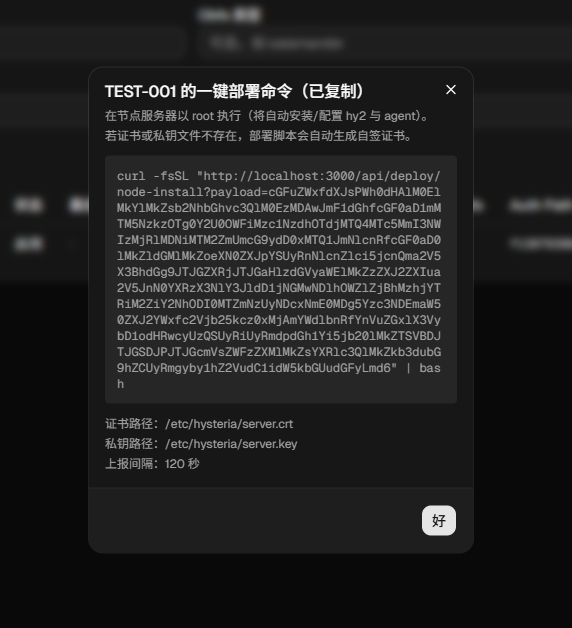

## 2. 一键安装 Hysteria2 以及 H2O Agent

---

1. 进入面板后台 → **节点管理**。
2. 填写节点信息（名称、IP/域名、端口等），点击 **创建节点**。

3. 在节点列表里点击 **一键部署**。

4. 前往节点服务器执行。
5. 等待脚本执行完成，回到面板看节点状态是否在线。

> 说明：脚本会自动安装/配置 hy2 和 agent；证书不存在时会自动生成。

---
