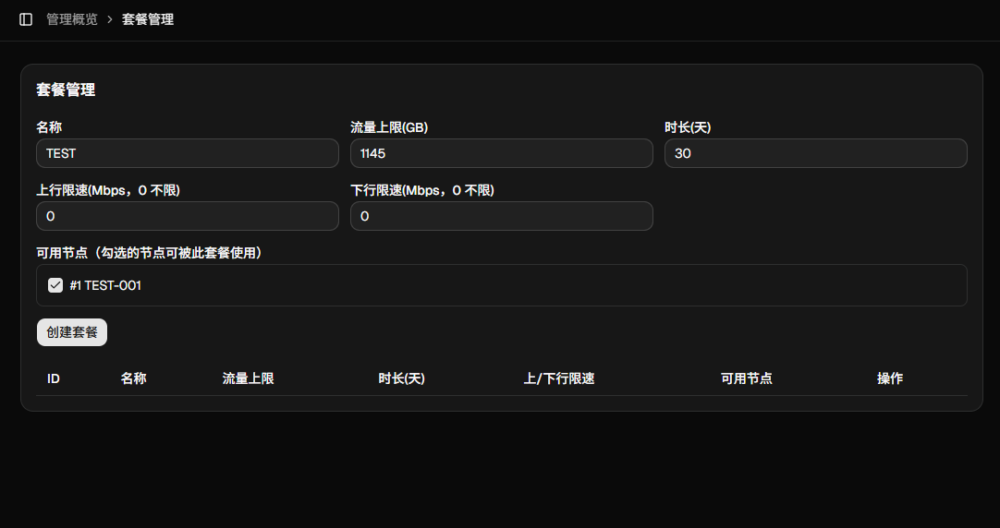
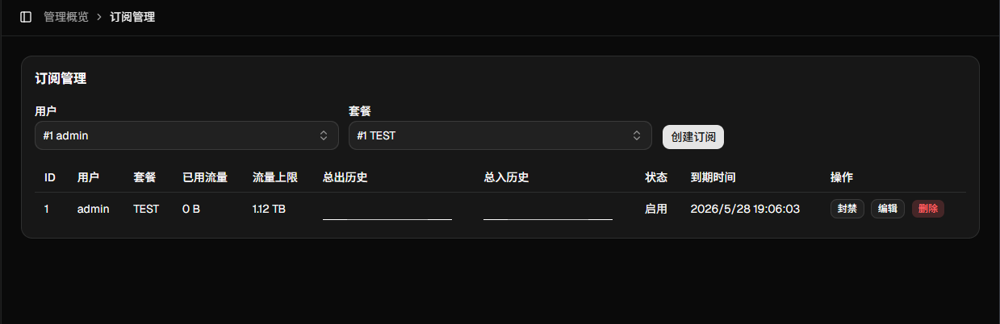

## 3. 新增套餐，分配用户订阅

---

1. 进入后台 → **套餐管理** → 新增套餐。  
   填写名称、时长、流量上限，并勾选可用节点后保存。

2. 进入后台 → **订阅管理** → 新增订阅。  
   选择用户、选择刚创建的套餐，设置到期时间后提交。

3. 打开用户后台（或让用户登录），在 **我的订阅** 查看状态是否生效。

---

Tips：

- 套餐改动后，会影响已关联该套餐的订阅（如可用节点、流量上限、限速）。

---